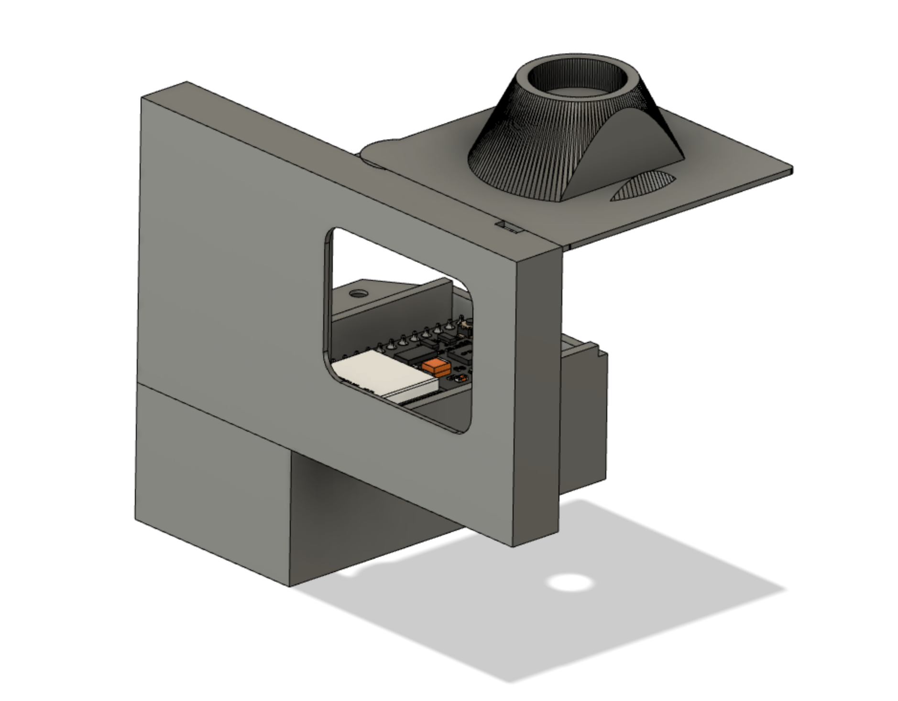
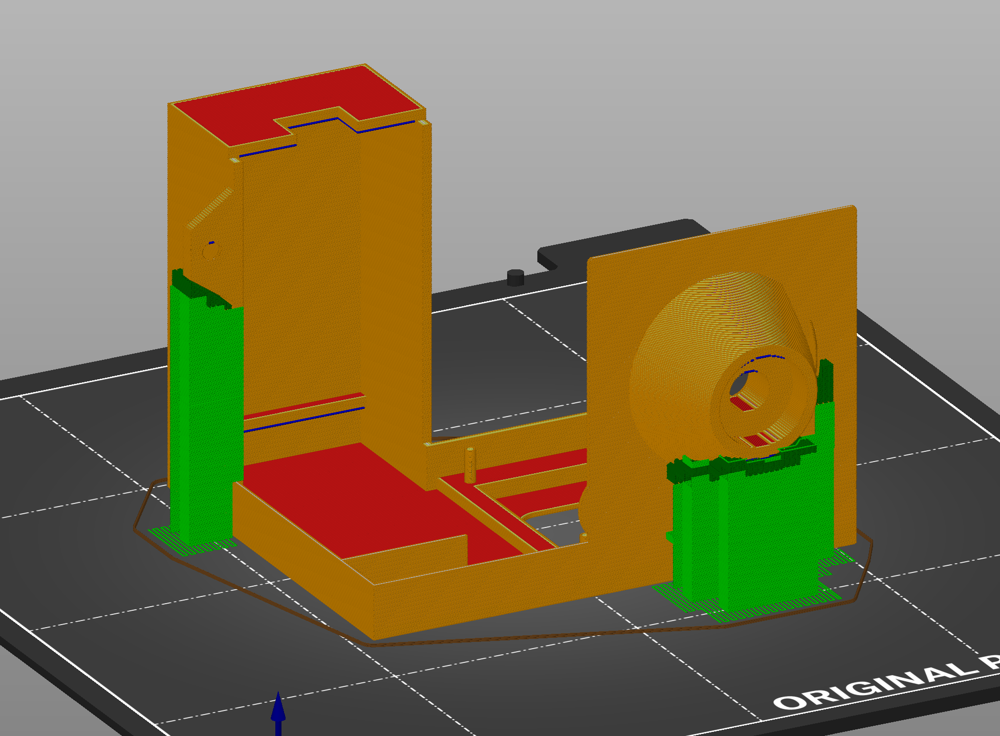
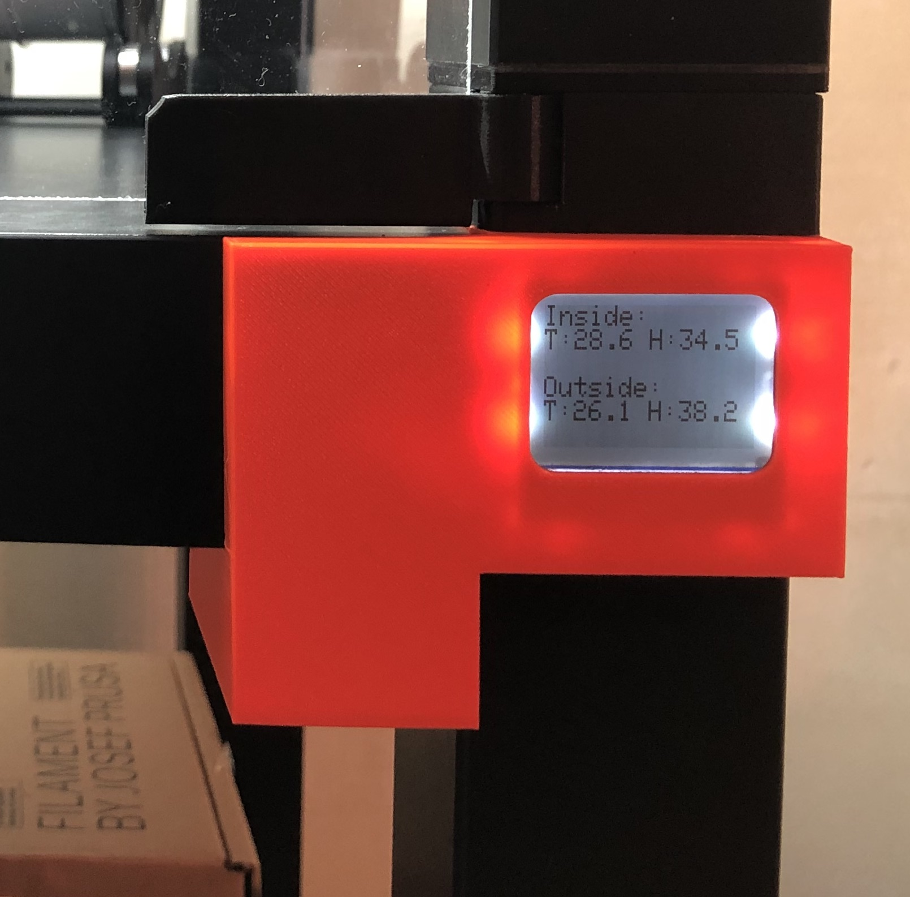
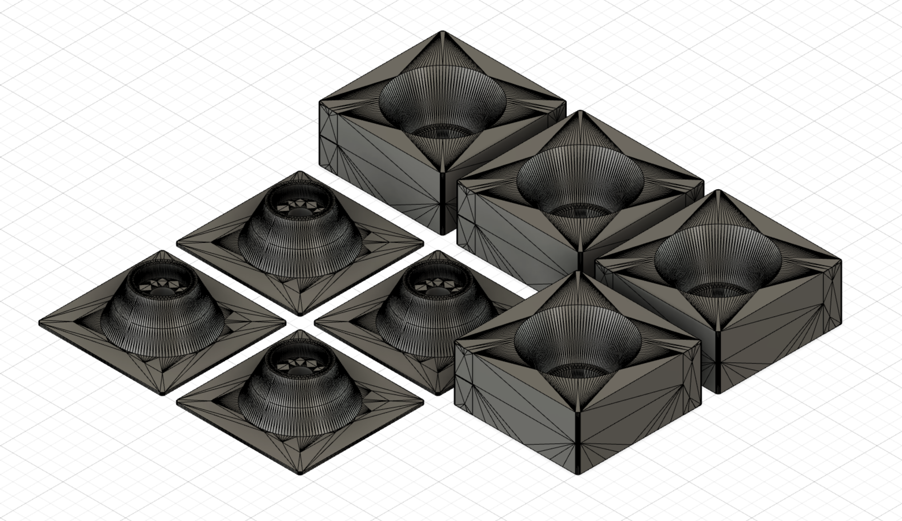
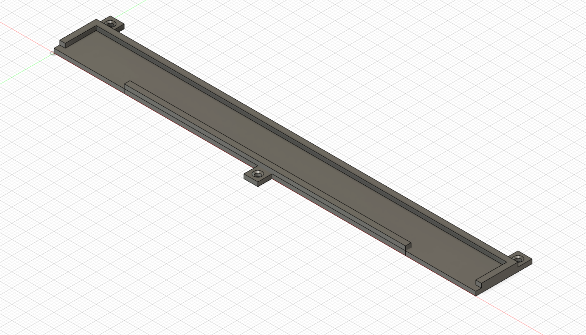
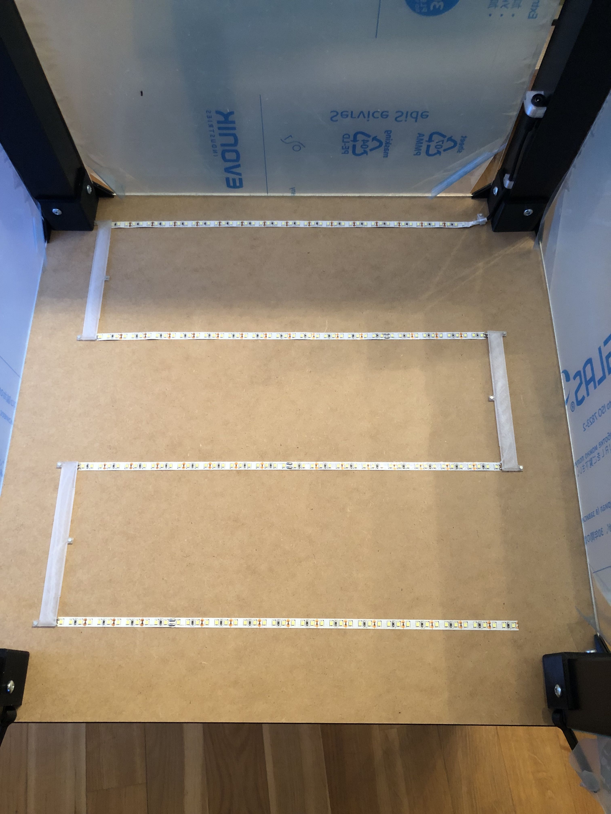

# Prusa enclosure extensions

As a new owner of Prusa Mini, I built an enclosure following the [official prusa guide](https://blog.prusaprinters.org/cheap-simple-3d-printer-enclosure/).
Besides few deviations from the guide, I also wanted to build temperature monitoring, based on esp32.

This repository contains source code for monitoring the inside/outside temperature (using sht3x temperature sensors) and displaying the data on Nokia 5110 lcd screen.
And the STL files for the temperature module and few other improvements for the enclosure.

## Temperature display
I wanted to avoid using visible screws or nails to attach the screen case, so I decided to print the display case as part of one of the bottom corner pieces.

## Bottom Corners
The original guide did not cover connecting bottom lack table (in case when building enclosure with 3 or more lack tables). I extracted and cut corner pieces that can be used to connect the bottom two tables.

## LED Cable Cover
I wanted to have multiple rows of LED strips and connect the rows with wires. I made the covers to hide the wires. The cover is attached with small 2mm nails.

